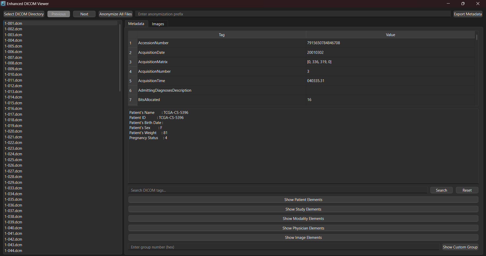
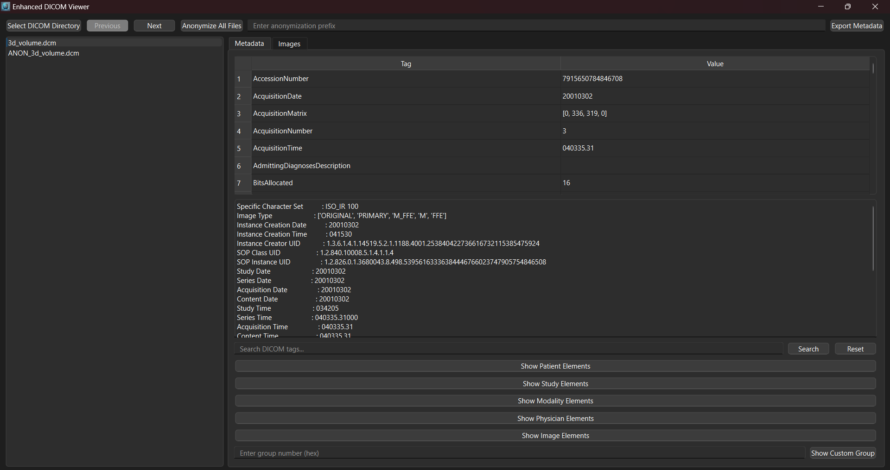
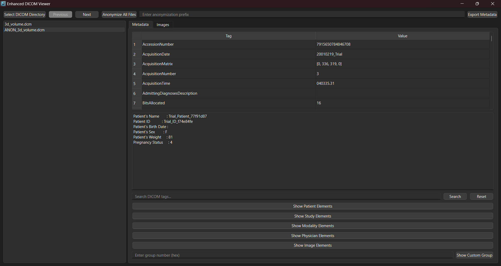
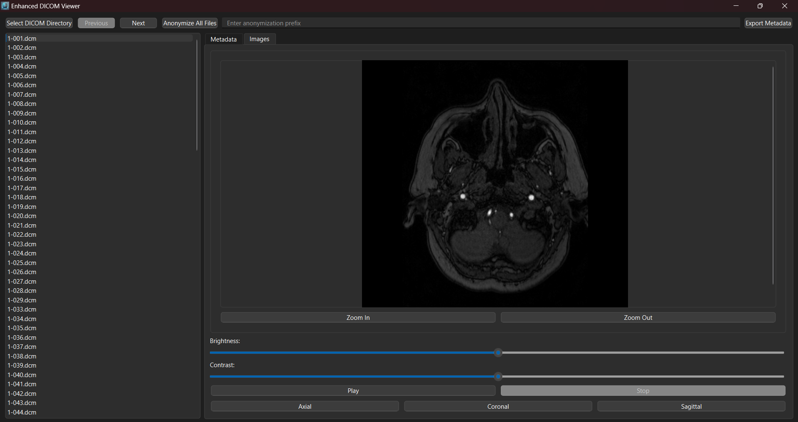
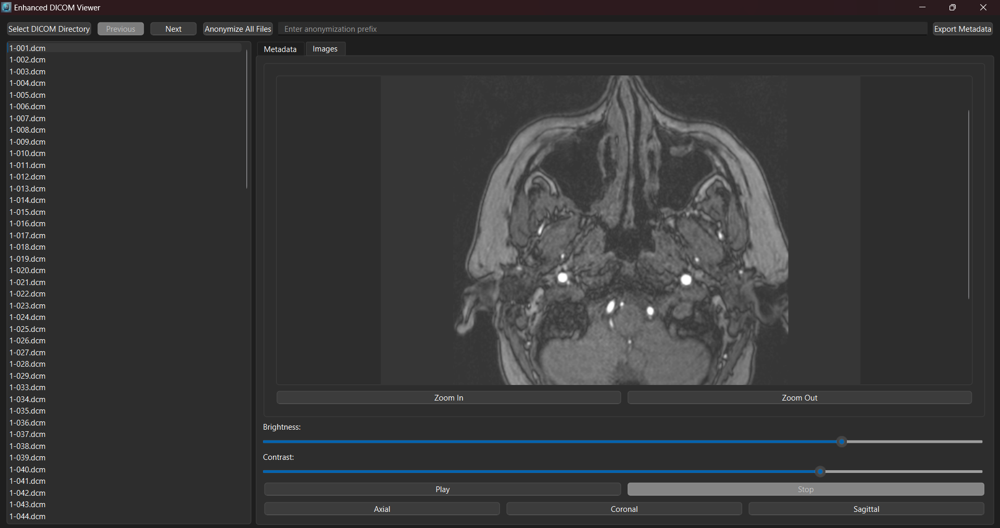
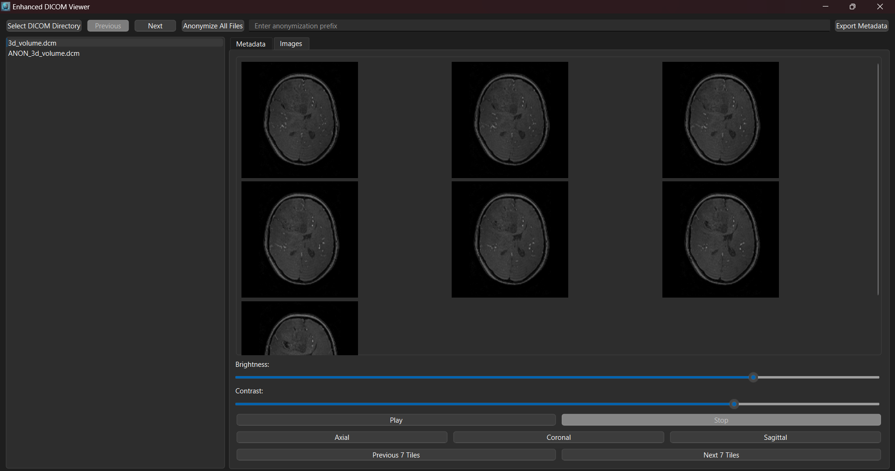

# DICOM Viewer


## Overview

The **DICOM Viewer** is a powerful tool designed for medical imaging professionals and researchers to streamline the analysis of DICOM files. This application offers a comprehensive suite of features, including metadata visualization, image adjustments, anonymization, multi-dimensional viewing, and advanced group filtering. With its user-friendly interface and robust functionality, the Enhanced DICOM Viewer is an essential tool for working with medical imaging data.

## Features

- **DICOM Directory Loading**: Load and browse through directories containing DICOM files.
- **Metadata Viewer**: View, search, and filter metadata tags and their corresponding values.
- **Advanced Group Filtering**: Display DICOM elements based on predefined or custom group numbers.
- **Image Display**: Visualize 2D and 3D DICOM images with brightness and contrast adjustment.
- **Zoom Controls**: Zoom in and out for detailed image inspection.
- **Anonymization**: Anonymize sensitive patient information with customizable prefixes.
- **Export Metadata**: Export DICOM metadata to a CSV file.
- **Image Navigation**: Navigate through axial, coronal, and sagittal views of 3D images.
- **Cine Mode**: Play 3D image slices in sequence for dynamic visualization.
- **Tile Navigation**: Display multiple image tiles for efficient navigation.
- **Custom Group Input**: Show elements from custom DICOM groups using decimal or hexadecimal input.
- **Dynamic Group Information**: Automatically calculate patient age and image size for enhanced metadata insights.

## Screenshots

- **Metadata Viewer**:





- **Anonymization**:



- **Image Viewer**:






## Installation

1. Clone this repository:
   ```bash
   git clone <repository-url>
   ```
2. Navigate to the project directory:
   ```bash
   cd enhanced-dicom-viewer
   ```
3. Install the required dependencies:
   ```bash
   pip install -r requirements.txt
   ```
4. Run the application:
   ```bash
   python DicomReader.py
   ```

## Requirements

- Python 3.9 or higher
- Dependencies listed in `requirements.txt` (automatically installed during setup)

## Notes

- Ensure that the `PyQt6` library is installed to support the GUI interface.
- Add the logo (`logo.png`) to the `assets/` folder for proper display in the application.
- The application is designed to handle standard DICOM files. Ensure your files conform to the DICOM format.


## Contributing

We welcome contributions to improve this project. Feel free to fork the repository, make changes, and submit a pull request.

## License

This project is licensed under the MIT License.

## Meet the Team

This project was developed by a passionate and talented team:

- [**Sief Eldin Sameh**](https://github.com/SiefEldinSameh)
- [**Fahd Ahmed**](https://github.com/fahdahmed10)
- [**Ahmed Salem**](https://github.com/Ahmedo0oSalem)
- [**Karim Farid**](https://github.com/eslamFared)


